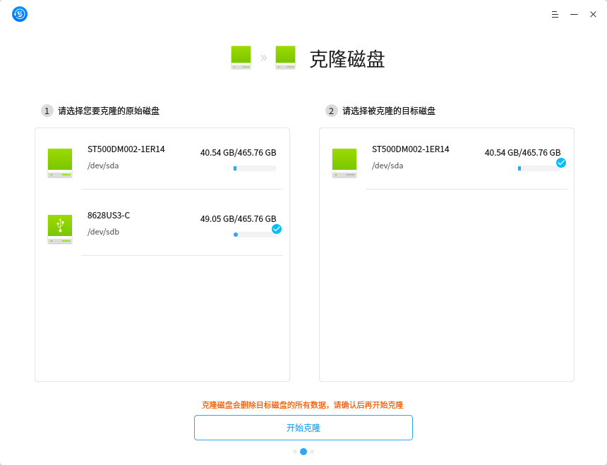
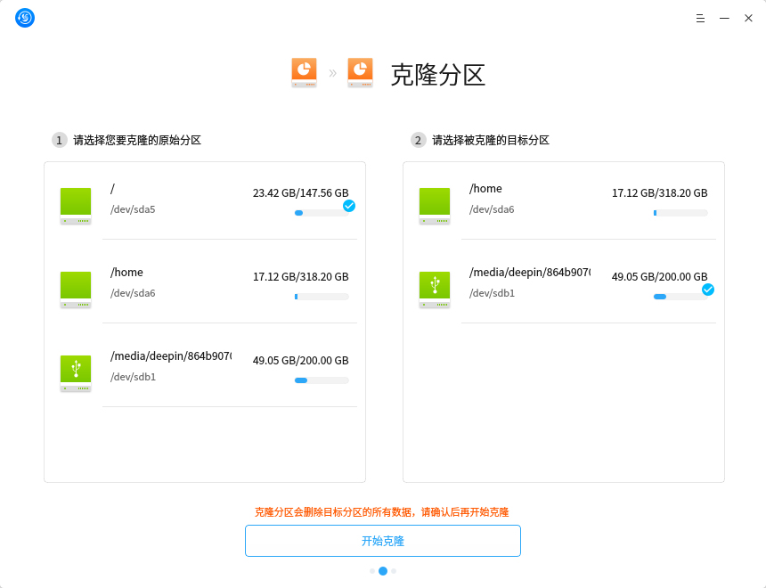
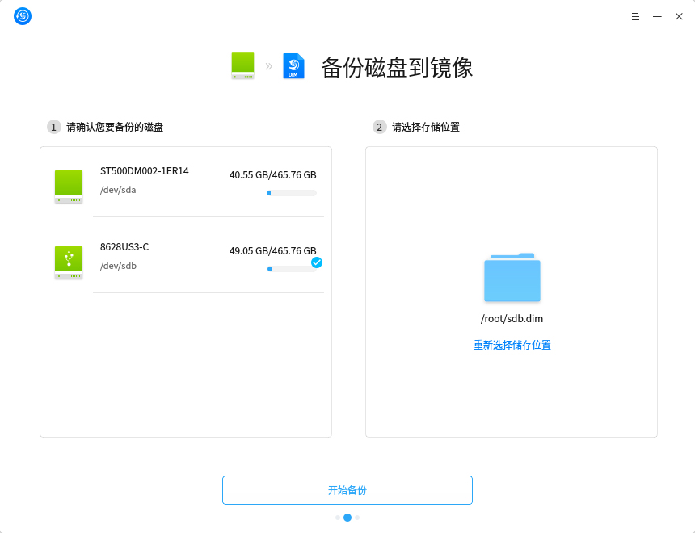
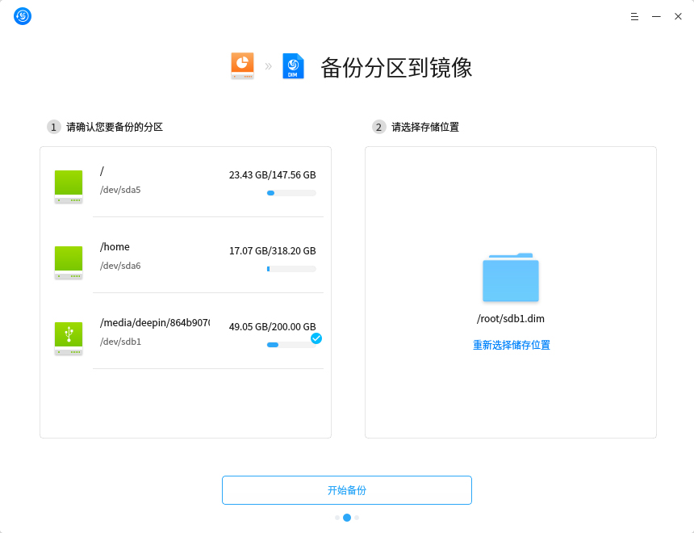
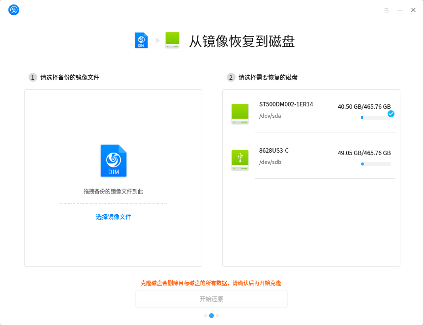
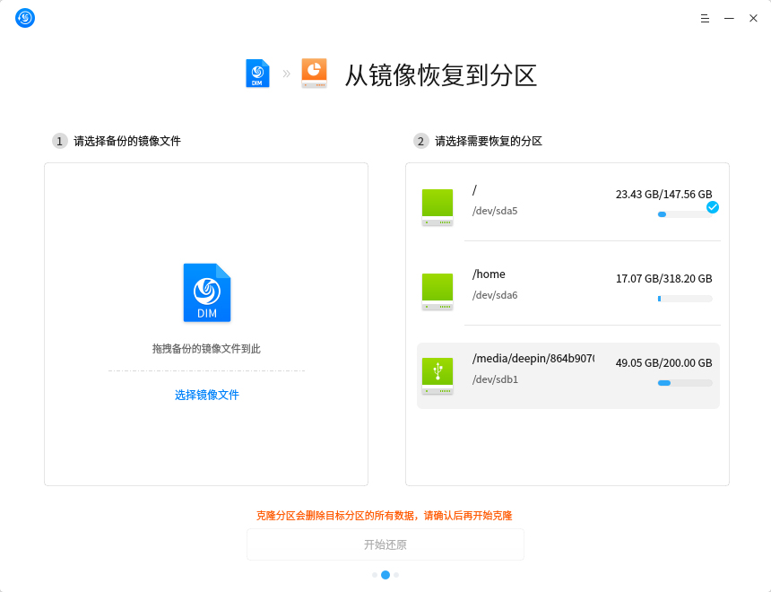

# 深度备份还原工具|../common/deepin-clone.svg|

## 概述

深度备份还原工具是深度操作系统中的备份还原小工具，包括了磁盘克隆、磁盘备份、磁盘还原、分区克隆、分区备份、分区还原等功能。

## 操作介绍

深度备份还原工具支持的文件系统类型包括：btffs, ext2, ext3, ext4, f2fs, fat12, fat16, fat32, hfsplus, minix, nilfs2, ntfs, reiser4, vfat，对于不支持的文件系统会对数据进行全量备份。支持的磁盘分区表格式包括：msdos(mbr), gpt。

>:使用深度备份还原工具执行克隆和还原操作，可能会删除目标磁盘或分区的所有数据，请注意界面的警示提醒，确认后再进行操作。

### 克隆磁盘

1.  在深度备份还原工具界面，选择  为操作介质。
2.  选择 。
3.  点击 **下一步**。
4.  分别选择要克隆的原始磁盘和被克隆的目标磁盘。
5.  点击 **开始克隆**。
6.  查看界面提醒，确认后点击 **继续**。
7.  耐心等待克隆过程，待界面出现克隆成功提示后点击 **确定**。

### 克隆分区

1.  在深度备份还原工具界面，选择  为操作介质。
2.  选择 。
3.  点击 **下一步**。
4.  分别选择要克隆的原始分区和被克隆的目标分区。
5.  点击 **开始克隆**。
6.  查看界面提醒，确认后点击 **继续**。
7.  耐心等待克隆过程，待界面出现克隆成功提示后点击 **确定**。

### 备份磁盘

1.  在深度备份还原工具界面，选择  为操作介质。
2.  选择 。
3.  点击 **下一步**。
4.  点击 **请选择存储位置**。
5.  选择好存储位置之后，点击 **保存** 回到备份界面。
6.  点击 **开始备份**。
7.  耐心等待克隆过程，待界面出现备份成功提示后点击 **确定**。

### 备份分区

1.  在深度备份还原工具界面，选择  为操作介质。
2.  选择 。
3.  点击 **下一步**。
4.  点击 **请选择存储位置**。
5.  选择好存储位置之后，点击 **保存** 回到备份界面。
6.  点击 **开始备份**。
7.  耐心等待克隆过程，待界面出现备份成功提示后点击 **确定**。

### 还原磁盘

1.  在深度备份还原工具界面，选择  为操作介质。
2.  选择 。
3.  点击 **下一步**。
4.  点击 **选择镜像文件**。
5.  选择好存储位置之后，点击 **打开** 回到还原界面。
6.  点击 **开始开始还原**。
7.  耐心等待还原过程，待界面出现还原提示后点击 **确定**。

### 还原分区

1.  在深度备份还原工具界面，选择  为操作介质。
2.  选择 。
3.  点击 **下一步**。
4.  点击 **选择镜像文件**。
5.  选择好存储位置之后，点击 **打开** 回到还原界面。
6.  点击 **开始开始还原**。
7.  耐心等待还原过程，待界面出现还原提示后点击 **确定**。

### 维护模式

使用深度备份还原工具可能会遇到磁盘或分区被占用的情况，克隆、还原、备份的原始位置和目标位置都会存在这个情况。此时您可以根据界面提示进入Live系统，然后再进行相关操作。
Live系统所有的代码和数据都运行在内存中，所有磁盘和分区都不会被挂载，也不存在对文件的读写操作。

## 主菜单

### 帮助

您可以点击帮助获取深度备份还原工具的帮助手册，通过帮助进一步让您了解和使用深度备份还原工具。

1. 在深度备份还原工具界面，点击 。
2. 点击 **帮助**。
3. 查看关于深度备份还原工具的帮助手册。

### 关于

您可以点击关于查看深度备份还原工具的版本介绍。

1. 在深度备份还原工具界面，点击 。
2. 点击 **关于**。
3. 查看关于深度备份还原工具的版本和介绍。

### 退出

您可以进入菜单栏点击退出深度备份还原工具。

1. 在深度备份还原工具界面，点击 。
2. 点击 **退出**。

